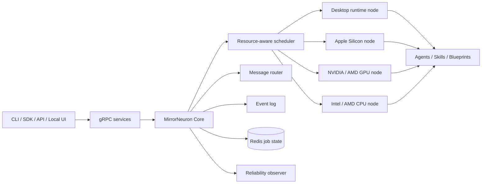
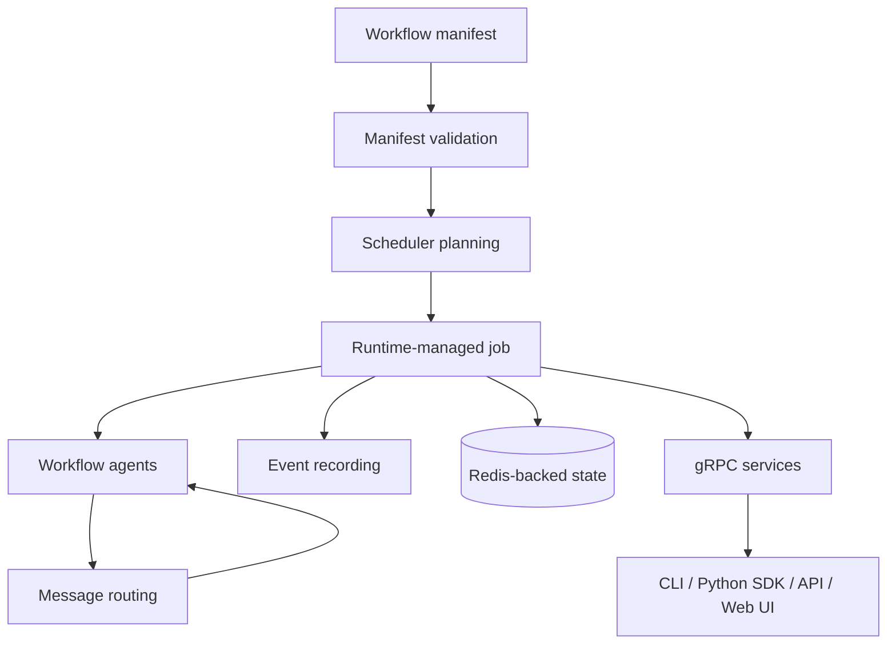

<h1 align="center">MirrorNeuron Core 🧠</h1>

<p align="center">
  <strong>Desktop-first runtime for durable, self-organizing AI workflows.</strong>
</p>

<p align="center">
  <a href="https://github.com/MirrorNeuronLab/mn-docs"></a>
  <a href="https://github.com/MirrorNeuronLab/MirrorNeuron/blob/main/LICENSE"></a>
  <a href="https://github.com/MirrorNeuronLab/MirrorNeuron/security/policy"></a>
  
  
  
  
</p>

MirrorNeuron Core is the Elixir/OTP runtime at the center of the MirrorNeuron
project: a durable, message-driven foundation for AI workflows that need to keep
running, recover cleanly, and coordinate work across agents, services, and local
machines.

MirrorNeuron is built around a simple direction: software is moving from
hardcoded workflows and static UIs toward reusable intelligence. An agent should
be able to assemble the workflow logic and task-specific interface it needs at
runtime, while the infrastructure underneath stays deterministic, observable,
and reliable.

Core is that infrastructure layer. It runs workflow graphs, stores job state,
routes messages between runtime nodes and agents, records events, coordinates
local or clustered execution, and exposes gRPC services for the surrounding
MirrorNeuron ecosystem.

> [!IMPORTANT]
> MirrorNeuron is in alpha. APIs, manifests, release artifacts, and ecosystem
> components may change between releases.

## Managed model residency

Managed DMR models are retained by physical run identity on the native owner node.
Completion, failure, cancellation and deletion release those references. The last
reference invokes `docker model unload <model>` after active requests drain;
downloaded weights, configuration and installed-model ownership remain intact.
Concurrent runs (including runs of the same definition) keep independent
references. Paused runs retain their models. SDK-managed gateway requests also
retain the actual serving owner, including fallback routes.

Terminal run markers reject late preparation or requests. Failed unloads retain
retryable ownership records; the native resource reconciler retries when Core
confirms a terminal run, and preserves ambiguous ownership. Existing untracked
or interactive models are not automatically swept. Workers, native SDK/gateway,
and Core must be upgraded together for automatic terminal cleanup; changing
source does not update an installed binary runtime.

## Contents

- [Why MirrorNeuron Core exists](#why-mirrorneuron-core-exists)
- [Desktop runtime, not cloud runtime](#desktop-runtime-not-cloud-runtime)
- [Private swarm model](#private-swarm-model)
- [Hardware strategy](#hardware-strategy)
- [The idea: generated software, deterministic runtime](#the-idea-generated-software-deterministic-runtime)
- [Features](#features)
- [Architecture at a glance](#architecture-at-a-glance)
- [When to use this repository](#when-to-use-this-repository)
- [Quick install](#quick-install)
- [Local development](#local-development)
- [Usage](#usage)
- [Resource-aware scheduling preview](#resource-aware-scheduling-preview)
- [Adaptive runtime reliability](#adaptive-runtime-reliability)
- [Execution profiles](#execution-profiles)
- [Configuration highlights](#configuration-highlights)
- [API boundary](#api-boundary)
- [Project structure](#project-structure)
- [Testing](#testing)
- [Deployment and releases](#deployment-and-releases)
- [Troubleshooting](#troubleshooting)
- [Ecosystem](#ecosystem)
- [Documentation](#documentation)
- [Roadmap](#roadmap)
- [Contributing](#contributing)
- [Security](#security)
- [License](#license)

---

## Why MirrorNeuron Core exists

Most agent prototypes begin as a prompt, a script, or a tightly coupled workflow
UI. That works until the work becomes long-running, multi-step, interruptible, or
spread across more than one process. At that point, the agent needs more than a
model call: it needs a runtime.

MirrorNeuron Core focuses on the deterministic side of agentic software.

<table>
<tr>
<td><b>Durable execution</b></td>
<td>Run workflow graphs with persisted job state, event history, terminal state, and recovery-aware runtime behavior.</td>
</tr>
<tr>
<td><b>Desktop-first operation</b></td>
<td>Target local desktops, workstations, and private multi-computer swarms instead of requiring a managed cloud control plane.</td>
</tr>
<tr>
<td><b>Message-driven coordination</b></td>
<td>Route work between agents and services through explicit runtime messages instead of hidden in-process coupling.</td>
</tr>
<tr>
<td><b>Resource-aware placement</b></td>
<td>Plan service and batch agents onto eligible runtime nodes using CPU, memory, disk, GPU, constraints, and execution profiles.</td>
</tr>
<tr>
<td><b>Self-healing by design</b></td>
<td>Use OTP supervision, reconnect policies, reliability strategies, persisted state, and cluster health checks to keep local workflow execution recoverable.</td>
</tr>
<tr>
<td><b>Stable service boundary</b></td>
<td>Expose protobuf-backed gRPC services so CLIs, SDKs, APIs, agents, blueprints, and tools can share the same runtime core.</td>
</tr>
</table>

The goal is to let the edge of the system stay flexible — generated interfaces,
generated workflow logic, task-specific agents — while the center of the system
stays boring in the best possible way: stateful, testable, recoverable, and
explicit.

---

## Desktop runtime, not cloud runtime

MirrorNeuron Core is designed for developers who want AI workflows to run on the
machines they already own: a laptop, a workstation, a home lab box, a local GPU
machine, or a small private swarm of trusted computers.

You should not need a complete Kubernetes-style platform to make desktop
workflows reliable. Core borrows useful ideas from systems like **Airflow** and
**Nomad** — durable runs, explicit job state, scheduling, placement constraints,
resource admission, observability, and recovery — and reshapes them for local
runtime environments.

```text
Cloud-first orchestration
  cluster account + hosted control plane + infrastructure team + remote workers

MirrorNeuron Core
  desktop PC + local Redis + runtime nodes + private swarm when needed
```

This repository is not trying to be a cloud platform. The focus is local
reliability: workflows that are easy to start, easy to inspect, and able to
recover from ordinary desktop failures such as process restarts, flaky peer
nodes, resource contention, or unavailable executors.

---

## Private swarm model

A single desktop should be enough for many workflows. When more capacity is
needed, Core can coordinate local or clustered execution across private machines.
Think of it as a small, trusted runtime fabric for developer-owned hardware.



A private swarm is not a requirement. It is the scaling path when a workflow
needs another machine: attach the node, advertise its capabilities, and let the
runtime decide where eligible work can run.

---

## Hardware strategy

MirrorNeuron Core aims to reduce the amount of hardware-specific work developers
need to do. The workflow should describe what it needs; the runtime should match
that need to available local capacity.

The current runtime surface already includes node capabilities, GPU advertising,
resource admission, scheduler constraints, and execution profiles. The hardware
target is ordinary developer-owned compute:

| Hardware class | Runtime direction |
| --- | --- |
| Intel / AMD CPUs | Treat standard CPU machines as first-class runtime nodes for generic workflow and model work. |
| Apple Silicon | Treat local macOS arm64 machines as useful runtime capacity when the execution profile and model backend fit. |
| NVIDIA GPUs | Advertise GPU capacity and capabilities so accelerator-heavy agents can be placed on eligible nodes. |
| AMD GPUs | Keep GPU placement generic enough that supported backends can advertise AMD GPU capacity where available. |
| Specialized boxes | When a workflow needs dedicated acceleration, surface that requirement clearly so the user can attach a capable machine — for example, a dedicated NVIDIA workstation or accelerator box — to the private swarm instead of rewriting the workflow. |

The intended developer experience is simple: run the workflow. If the workflow
can run on available generic hardware, the runtime should allocate resources and
use the right execution profile. If it needs special hardware, the runtime should
make that visible early and tell the developer what kind of node must be added.

---

## The idea: generated software, deterministic runtime

MirrorNeuron is designed for a different shape of application: one where the
agent can generate or adapt the logic and interface it needs while the runtime
remains explicit and dependable.

```text
Traditional app
  fixed UI + fixed workflow + hidden state

Agent-native app
  generated task interface + generated workflow logic + deterministic runtime
```

For developers, MirrorNeuron Core is the lower-level runtime that other pieces
build on: scheduling, coordination, events, persistence, clustering behavior,
resource admission, reliability policies, and service contracts.

That separation matters. Agents can reorganize the software experience at
runtime, but workflow execution should still have clear state, clear ownership,
clear placement, and clear recovery behavior.

---

## Features

| Feature | Status | Notes |
| --- | ---: | --- |
| Workflow manifest validation | Available | Validates graph structure and supported runtime primitives. |
| Message-driven execution | Available | Routes workflow messages between runtime nodes and agents. |
| Built-in runtime primitives | Available | Includes `router`, `executor`, `aggregator`, `sensor`, and `module`. |
| Durable job state | Available | Persists compact job control, events, artifacts, delivery state, and terminal results in Redis; runtime loss starts a clean fenced attempt. |
| Runtime monitoring | Available | Lists jobs, job details, cluster overview, metrics, and dead letters. |
| Cluster coordination | Available | Uses Erlang distribution plus `libcluster` and Horde. |
| Redis high-availability helpers | Available | Includes scripts and config for Redis Sentinel development workflows. |
| Shared run artifacts | Available | Supports pre-mounted shared filesystem storage for large payloads and per-job artifact staging across LAN cluster nodes. |
| gRPC services | Available | Job, cluster, and observability protobuf services are included. |
| Resource-aware scheduling | Preview | Plans service and batch agents onto eligible nodes using CPU, memory, disk, GPU, constraints, and execution profiles. |
| REST API, CLI, Web UI, SDK | External components | Provided by separate ecosystem repositories. |

---

## Architecture at a glance



Core sits between higher-level developer surfaces and the operational substrate
that keeps workflow execution reliable. Higher-level components can change how
agents are authored, invoked, or presented to users without requiring each one to
rebuild the runtime primitives from scratch.

---

## When to use this repository

Use MirrorNeuron Core when you are building or extending systems that need:

- AI workflows that continue across multiple steps instead of completing in one
  request-response turn.
- Desktop or workstation execution with durable runtime behavior.
- A private multi-computer swarm without adopting a cloud-first orchestration
  stack.
- Agent coordination through messages and explicit runtime services.
- Redis-backed job state for durable execution.
- Event recording around workflow execution.
- Resource-aware scheduling across CPU, memory, disk, GPU, constraints, and
  execution profiles.
- A gRPC/protobuf boundary for integrating runtimes, SDKs, API services, agents,
  blueprints, or skills.

Core is not a model provider, hosted cloud service, monolithic desktop app, or
complete Kubernetes replacement. It is the dependable runtime layer underneath
agent-native workflow software.

---

## Quick install

Use the deployment repository installer when installing MirrorNeuron as a
user-facing local system:

```bash
curl -fsSL https://mirrorneuron.io/install.sh | bash
```

For the released-package installer, use `mn-deploy/install_new.sh` from the
deployment repository:

```bash
git clone https://github.com/MirrorNeuronLab/mn-deploy.git
cd mn-deploy
./install_new.sh
```

That installer uses released packages instead of source checkouts:

- Core runtime from GitHub Release OTP tarballs
- Python CLI/API/SDK packages from PyPI
- Web UI package from npm

---

## Local development

Clone the core repository and install dependencies:

```bash
git clone https://github.com/MirrorNeuronLab/MirrorNeuron.git
cd MirrorNeuron
mix deps.get
```

Start Redis locally or with Docker:

```bash
docker run --rm --name mirror-neuron-redis -p 6379:6379 redis:7
```

Run the runtime in development mode:

```bash
mix run --no-halt
```

Build a local OTP release:

```bash
MIX_PROJECT_VERSION=1.0.0 MIX_ENV=prod mix release --overwrite
_build/prod/rel/mirror_neuron/bin/mirror_neuron start
```

---

## Usage

### Validate a manifest

```elixir
MirrorNeuron.validate_manifest("path/to/manifest.json")
```

### Plan placement before running

```elixir
MirrorNeuron.plan_manifest("path/to/manifest.json")
```

### Run a manifest

```elixir
MirrorNeuron.run_manifest("path/to/manifest.json")
```

For repeatable work, use the durable job model: one `job_id` owns the
configuration and shared data, while every manual or scheduled execution gets
a distinct `run_id`. Retries retain their run and receive a new attempt. See
[JOBS_AND_RUNS.md](JOBS_AND_RUNS.md) for the full identity, storage, lifecycle,
migration, and safety contract.

Inactive definitions can atomically replace their executable bundle when the
graph and blueprint identities are unchanged. The replacement preserves job
data, schedules, and run history. Starting a stored job changes only run and
attempt identity plus run-output paths; definition-scoped submission,
container, and input resources stay unchanged.

### Inspect jobs and events

```elixir
MirrorNeuron.list_jobs()
MirrorNeuron.inspect_job("job-id")
MirrorNeuron.inspect_agents("job-id")
MirrorNeuron.events("job-id")
```

### Pause, resume, or cancel a job

```elixir
MirrorNeuron.pause("job-id")
MirrorNeuron.resume("job-id")
MirrorNeuron.cancel("job-id")
```

Pausing is idempotent. For an in-flight workflow step, Core stops the active
worker before reporting the job as paused. Resuming recreates any worker stopped
by that pause in a paused state, then returns the job to `running` and
immediately reclaims its durable in-flight delivery. Messages accepted while
paused remain queued until that transition completes.

Cancellation is durable across a cluster. When the owning node cannot be
reached, Core records `cancelling`, advances the job fence, revokes its lease,
and returns `cancellation_pending` immediately. The owner performs local agent,
sandbox, and checkpoint cleanup when it rejoins; the job becomes `cancelled`
only after every recorded owner acknowledgement. Recovery, resume, scheduling,
and drain migration do not run while a job is `cancelling`. The reconciler uses
one Redis-side scan of a pending-only cancellation index; acknowledgement
removes the index entry while retaining the cancellation record for audit.
Before acknowledging, the owning runtime also terminates every registered
HostLocal command for the job and waits for the owned process groups to exit.
Operators may clear a `cancelling` job after that durable fence is committed.
Core removes the public job and global artifacts but retains the cancellation
record and fence as a cleanup tombstone. Stale workers cannot recreate the
cleared job; a worker with the same node name finishes its local cleanup when
it rejoins. The final acknowledgement releases the tombstone fence without
recreating job events or public state.
HostLocal payloads receive Core's internal loopback gRPC client target; a
manifest may explicitly override that target when it owns a different reachable
control endpoint.
Published Core images include Python 3.11 for HostLocal blueprint commands.
Prepared `python_environment` resources also put their `bin` directory first
for HostLocal console-script entrypoints.
The Docker build pins the Debian base and verifies that `python3` resolves to
Python 3.11 so an upstream rolling image cannot change an immutable release.

### Durable group operations

`cancel_all_jobs`, terminal-job clearing, node reconciliation, and node drain
are persisted operations rather than one synchronous fan-out. Start an allowed
operation with `MirrorNeuron.start_operation/2`, inspect it with
`MirrorNeuron.operation/1`, and replay its ordered progress records with
`MirrorNeuron.operation_events/2`. Workers complete out of order under bounded
native OTP task concurrency (8 for cancellation/clear, 2 for reconcile/drain).
Unfinished records are resumed after a Core restart. Ordinary terminal runs are
marked cleared only after their job-owned processes, sandboxes, checkpoints,
services, staged storage, artifacts, leases, delivery state, and Redis records
have been removed from every recorded runtime node. Durably fenced cancelling
runs may be removed from public state while node-local cleanup remains recorded
in the cancellation tombstone.

---

## Resource-aware scheduling preview

MirrorNeuron can plan service and batch workflow agents onto eligible runtime
nodes before starting a job. Node-level `resources` and `constraints` may be
declared in the manifest, and `policies.scheduler.strategy` can be `binpack` or
`spread`.

```json
{
  "policies": {
    "job_type": "batch",
    "scheduler": { "strategy": "binpack" }
  },
  "nodes": [
    {
      "node_id": "worker",
      "agent_type": "executor",
      "resources": {
        "cpu_cores": 2,
        "memory_mb": 4096,
        "gpu_count": 1,
        "ports": [
          { "label": "api", "port": "auto", "protocol": "http" }
        ]
      },
      "constraints": [
        { "attribute": "capabilities", "operator": "contains", "value": "cuda" }
      ]
    }
  ]
}
```

Submitted jobs persist their scheduler plan under the job's `scheduler` field so
API and monitoring clients can inspect where agents were intended to run.
Port resources accept a fixed integer or `"auto"`. Automatic ports are allocated
from the node's dynamic/private range, remain exclusive for the active
placement, and are exposed to the runner as `MN_PORT_<LABEL>`. Agent service
declarations can reference the resolved value with an environment template such
as `"${env.MN_PORT_API}"`. Containerized nodes can set `MN_AUTO_PORT_START` and
`MN_AUTO_PORT_END` to the bounded range published by their runtime.

An opt-in manifest can instead declare one always-warm response service outside
the run DAG:

```json
{"response_service": {"enabled": true}}
```

Core supervises this definition-scoped service on the Job owner node, starts it
asynchronously, routes bounded unary questions to it, and stops it before Job
data reset or deletion. It remains available before the first Run and between
Runs. Asking it a question never creates or keeps alive a Run. A degraded
dependency warm-up is retried with bounded backoff, allowing the service to
recover after Core or a model gateway finishes starting. A confirmed deletion
can force-detach a responder whose native shutdown is stalled, so it can still
cancel runtime resources and remove the Job; its native cleanup then finishes
in the background. Archive and reset retain their strict shutdown behavior.

An executable declaration may additionally include one validated `bounded_mcp`
agent. Its optional `preflight` binds selected effects to a declared read-only
tool, an exact argument set, and scalar result requirements. This lets the
response agent require a fresh live safety check before an effect without
granting arbitrary tool or predicate execution.

---

## Adaptive runtime reliability

Manifests may set `"recovery_mode": "auto"` or omit `recovery_mode`. For new
jobs, the runtime resolves the requested policy into an effective policy based
on observed cluster health:

| Runtime condition | Effective behavior |
| --- | --- |
| Single node or uncertain/flapping cluster | Use `local_restart`. |
| Healthy multi-node cluster with a durable bundle and eligible placement | Use `cluster_recover`. |
| Explicit `manual_recover` | Keep manual recovery. |
| Explicit `cluster_recover` on an unsafe single-node cluster | Start degraded as `local_restart`. |

The runtime persists both `requested_recovery_policy` and effective
`recovery_policy`, plus a compact `reliability` map for observability. Running
job policies are not rewritten when cluster health changes; reliability events
are emitted instead.

Redis is the only durable coordination source. Core does not write or restore
agent-memory, workflow-ledger, pending-policy, or disk-checkpoint snapshots.
`local_restart`, `cluster_recover`, and `manual_recover` are the supported policy
names, but they now select clean-attempt placement or approval behavior rather
than process-state restoration.

This is especially important for desktop environments, where machines sleep,
restart, disconnect, run out of local resources, or appear and disappear from a
private network more often than cloud workers do.

If an agent, coordinator, node, or host is lost, the runtime treats it as a job
attempt boundary. It acquires a newer fenced lease epoch, rejects old writes,
cleans attempt-owned deliveries and execution resources, resets local workflow
and agent state, and seeds the manifest inputs again. Public job state exposes
`attempt`, `attempt_started_at`, and `restart_reason`. Effectful executor and
module nodes must declare `safe_to_retry`, `idempotent`, or a stable idempotency
key before automatic redo. Other work pauses for operator approval; manual
resume authorizes a clean attempt. Retry budgets and backoff are durable at the
job-attempt level.

Every agent-to-agent message, including messages whose agents happen to run on
the same node, follows one acknowledged Redis Streams path. Enqueue is
idempotent by `message_id`; an agent claims a delivery lease, renews it while
working, and ACKs only after its state and emitted messages are durable. Missing
ACKs are reclaimed with bounded retries and then dead-lettered. BEAM/Horde
signals are wake-ups only, so a dropped cross-node signal cannot lose the
message. Workflow state changes and run completion use the same mechanism for
agent-to-coordinator reports; high-volume telemetry remains best-effort because
it is observational rather than state-bearing. Streams, receipts, counters,
and indexes all carry TTLs; ACK deletes the stream entry, explicit job deletion
removes delivery keys immediately, and terminal jobs shorten remaining delivery
retention to one hour. Delivery is at-least-once, so handlers and external side
effects must remain idempotent.

---

## Execution profiles

Dependency-heavy agents should reference an execution profile instead of
installing native packages during each run. Configure the profile on runtime
nodes, then reference it from the worker config.

```bash
MN_EXECUTION_PROFILES_JSON='{"opencv-video-guardian":{"image":"registry.local/business_facility_safety_video_guardian:2026-05","pool":"opencv_gpu","pool_slots":1,"gpu":true,"required_capabilities":["video-codec:h264"],"policy":"policies/video-egress.yaml","reuse_shared_sandbox":true,"persistent_workspace":true,"warmup_command":"python -c \"import cv2\""}}' \
MN_NODE_EXECUTION_PROFILES=opencv-video-guardian \
MN_NODE_CAPABILITIES=video-codec:h264,ffmpeg \
mix run --no-halt
```

OpenShell SDK workers that consume the workflow's durable run store should set
`sync_shared_storage=true`. Core copies the job-scoped `inputs` and `outputs`
directories into an invocation-owned sandbox path, rewrites shared-storage
references for that invocation, and copies `outputs` back before returning the
runner result. The source root must be inside the configured runtime shared
storage root.

```json
{
  "node_id": "video_guardian",
  "agent_type": "sandbox_worker",
  "config": {
    "execution_profile": "opencv-video-guardian"
  }
}
```

The BEAM runtime keeps orchestration, leases, placement, reconnect, and manual
recovery. Heavy dependencies such as OpenCV, ffmpeg, and model runtimes stay in
the profile image or a prewarmed node cache. When a manifest selects an
execution profile, the profile owns OpenShell security settings such as image,
policy, remote access, SSH key, workspace reuse, upload path, pool, GPU, and
capability settings.

---

## Configuration highlights

Runtime configuration is owned by `MirrorNeuron.Config`. On startup it loads
defaults from `.env` and then `.env.<environment>`, where the environment comes
from `MN_ENV` and defaults to `dev`. Real shell environment variables always win
over values loaded from files:

```text
real environment variables
> .env.${MN_ENV}
> .env
> built-in safe defaults
```

`MN_ENV=dev` and `MN_ENV=development` load `.env.dev`; `MN_ENV=test` loads
`.env.test`; `MN_ENV=prod` and `MN_ENV=production` load `.env.prod` when it is
present. Production does not require any `.env` file.

| Variable | Purpose |
| --- | --- |
| `MN_REDIS_URL` | Redis connection URL for persisted runtime data. |
| `MN_REDIS_NAMESPACE` | Prefix/namespace for stored MirrorNeuron runtime data. |
| `MN_BLUEPRINT_PYTHON_ENVS_DIR` | Node-local HostLocal Python environment cache; defaults to `$MN_HOME/cache/blueprint-python-envs`. Do not place derived environments in synchronized shared storage. |
| `MN_RECOVERY_EVAL_TTL_SECONDS` | Retention for terminal recovery eval diagnostics; defaults to 86400. |
| `MN_CORE_HOST` | Host/IP used by the gRPC listener; defaults to loopback-style local binding. |
| `MN_GRPC_PORT` | gRPC service port. |
| `MN_GRPC_AUTH_TOKEN` | Single client-identity token for protected gRPC calls, including destructive operations. There are no operator/admin scopes. |
| `MN_LITELLM_MAX_CONCURRENT_REQUESTS` | Per-model-group chat/completion admission limit. Defaults to `auto`, which uses the healthy replica count; a positive integer is a hard upper bound. |
| `MN_LITELLM_MAX_CONCURRENT_EMBEDDINGS` | Node-local embedding requests admitted concurrently by a separate LiteLLM FIFO; defaults to 1 so short RAG calls cannot be starved behind long completions. |
| `MN_LITELLM_MAX_QUEUED_REQUESTS` | Maximum LiteLLM inference requests waiting for a slot; defaults to 64. |
| `MN_LITELLM_QUEUE_TIMEOUT_SECONDS` | Maximum time an inference request waits in the LiteLLM queue; defaults to 1800. |
| `MN_LITELLM_MAX_SLOT_SECONDS` | Safety deadline after which a leaked LiteLLM execution slot is released; defaults to 3600. |
| `MN_NODE_NAME` | Erlang node name used by release and cluster scripts. |
| `MN_CLUSTER_NODES` | Comma-separated Erlang node names for cluster discovery. |
| `MN_COOKIE` | Erlang distribution cookie; use a strong non-default value for distributed nodes. |
| `MN_JOB_LEASE_DURATION_MS` | Job lease duration for fenced runtime ownership; defaults to 60000. |
| `MN_JOB_LEASE_RENEW_INTERVAL_MS` | Job lease renewal cadence; defaults to 10000. |
| `MN_JOB_DATA_ROOT` | Root for persistent stable-job data; defaults to `$MN_HOME/job-data`. Each job is a validated direct child. |
| `MN_JOB_CALL_TIMEOUT_MS` | Timeout for runtime job control calls such as pause, resume, pressure, and external message submit; defaults to 15000. |
| `MN_CANCEL_JOB_CALL_TIMEOUT_MS` | Local coordinator cancellation call timeout; unavailable remote ownership is recorded as durable `cancellation_pending` instead of waiting for this timeout. Defaults to 5000. |
| `MN_SHARED_STORAGE_READY_TIMEOUT_SECONDS` | Maximum time a run with SDK-staged local inputs remains pending for its owner-local shared-storage inventory to verify; defaults to 1800. |
| `MN_MESSAGE_DEFAULT_TTL_SECONDS` | Default lifetime for an agent message; defaults to 86400. |
| `MN_MESSAGE_MAX_TTL_SECONDS` | Maximum accepted agent-message lifetime; defaults to 604800. |
| `MN_MESSAGE_ACK_RECEIPT_TTL_SECONDS` | Retention for ACK and dead-letter receipts; defaults to 3600. |
| `MN_MESSAGE_STREAM_TTL_SECONDS` | Maximum retention for Redis delivery streams, counters, and indexes; defaults to 604800. |
| `MN_MESSAGE_MAX_PENDING_PER_AGENT` | Durable pending-message cap per agent; defaults to 10000. |
| `MN_MESSAGE_MAX_PENDING_PER_JOB` | Durable pending-message cap per job; defaults to 100000. |
| `MN_MESSAGE_ACK_TIMEOUT_MS` | Delivery lease duration before an unacknowledged message can be reclaimed; defaults to 30000. |
| `MN_MESSAGE_LEASE_RENEW_MS` | Lease-renew cadence while an agent handles a message; defaults to 10000. |
| `MN_MESSAGE_DELIVERY_MAX_ATTEMPTS` | Processing attempts before dead-lettering; defaults to 10. |
| `MN_MESSAGE_DELIVERY_POLL_MS` | Redis delivery polling interval when no wake-up signal arrives; defaults to 1000. |
| `MN_RELIABILITY_STRATEGY` | Conservative runtime strategy resolver for new jobs. |
| `MN_NODE_RECONNECT_ATTEMPTS` | Runtime node reconnect attempts before jobs are paused for manual restart. |
| `MN_NODE_EXECUTION_PROFILES` | Comma-separated execution profiles this runtime node may advertise after warmup. |
| `MN_NODE_CAPABILITIES` | Comma-separated runtime capabilities such as `video-codec:h264` or `ffmpeg`. |
| `MN_NODE_GPU` | Optional override for whether this runtime node advertises GPU capacity. |
| `MN_RESOURCE_ADMISSION_ENABLED` | Enables local resource checks before accepting work. |
| `MN_BLOB_STORE_ROOT` | Durable content-addressed blob root. In LAN clusters, keep this under the replicated shared-storage root such as `/root/.mn/shared/blobs`. |
| `MN_JOB_ARTIFACT_ROOT` | Per-job artifact staging root. Defaults next to the blob root and is cleaned when terminal jobs age out or are deleted. |

Development example:

```bash
export MN_ENV=dev
cp .env.example .env.dev
mn-cli ...
```

Test example:

```bash
export MN_ENV=test
mn-cli ...
```

Production example:

```bash
export MN_ENV=production
export MN_HOME=/var/lib/mirrorneuron
export MN_LOG_LEVEL=info
export MN_API_HOST=0.0.0.0
export MN_API_PORT=8080
export MN_CORE_HOST=0.0.0.0
export MN_GRPC_PORT=50051
export MN_GRPC_AUTH_TOKEN=<client-identity-token>
mn-api ...
```

For Redis Sentinel, resource thresholds, network-only nodes, execution profiles,
and release deployment settings, start from `.env.example` and the documentation
repo. Do not commit real `.env` files or secrets.

Large job payloads are shared by filesystem path, not by a MirrorNeuron HTTP
artifact server. For a LAN cluster, each host bind-mounts its local
`${MN_HOST_SHARED_STORAGE_ROOT:-./mn/shared}` at the same logical container
location, and the CLI uses a Syncthing sidecar to replicate that directory
between joined nodes. The shared root contains `blobs/` for durable sha256
content and `jobs/` for temporary per-job staging. Set
`MN_SYNCTHING_REQUIRED=1` to fail startup/join when replication cannot be
started or peer-configured. The sidecar is LAN-only: on every start it disables
Syncthing relays, global discovery, NAT/STUN traversal, usage reporting,
automatic upgrade checks, and crash reporting while keeping local discovery
enabled. Configure peer devices with LAN or VPN addresses when they cannot be
discovered locally.
Filesystem watching remains enabled and the fallback rescan interval defaults
to 3600 seconds (`MN_SYNCTHING_RESCAN_INTERVAL_SECONDS`). Managed ignores keep
derived Python environments, staged Python sources, and local checkpoints out
of the replicated shared-data set.

SDK-staged local input trees have an atomic readiness inventory. Before it
sends any workflow entrypoint message, the owner Core verifies that marker and
each file on its own shared mount. A remote run stays `pending` with
`submission_storage_waiting` progress until replication is complete, starts
automatically with `submission_storage_ready`, or fails before source dispatch
on `MN_SHARED_STORAGE_READY_TIMEOUT_SECONDS` (default `1800`). This check uses
filesystem integrity only; Core does not need Syncthing API credentials.

---

## API boundary

MirrorNeuron Core includes protobuf definitions and generated Elixir modules for:

- `proto/job.proto`
- `proto/cluster.proto`
- `proto/observability.proto`
- `proto/operations.proto`

Generated modules live under `lib/mirror_neuron_grpc/`. The gRPC listener binds
to `MN_CORE_HOST` and listens on `MN_GRPC_PORT`.

Protected RPCs use one client identity from the `authorization` metadata header.
There are no operator/admin token scopes or credentials embedded in requests.

`mirrorneuron.job.v1.JobService` is the sole job contract. It owns durable job
definitions and their one-to-many runs; execution control and deletion always
target `run_id`. Responses keep expanded manifests and histories in durable storage and
return bounded lifecycle metadata plus bundle/artifact references.
Any connected federated Core resolves a job or run owner on demand, so operators
may issue JobService controls from a non-owner node. If `ArchiveJob` reaches a
known but unavailable owner, the submitting Core records a durable archive
tombstone, marks that stale projection `archive_pending`, and replays the archive
once the owner is reachable. A reachable owner response—success or a validation rejection—
clears the tombstone rather than retrying unexpectedly later.
If a confirmed `DeleteJob` reaches an unavailable owner, Core records a durable
delete tombstone instead. It returns `delete_pending` and removes the stale job
and run projections from normal lists immediately; owner-local data and runtime
resources are deleted only when replay reaches that owner. A reachable response
either completes the deletion and clears its projections or clears a rejected
tombstone.
`DeleteJob` and `DeleteRun` keep the normal 15-second peer connection bound but
allow up to five minutes for the forwarded owner request, since confirmed
cleanup may cancel runs and retire multiple bounded runtime resources.
Missing job/run lookups return gRPC `NOT_FOUND`, allowing owner discovery to
continue across peers and giving clients a stable missing-resource error.
Runtime-model preparation and LiteLLM route controls likewise forward to a
joined requested `node`; callers keep one Core ingress and never receive peer
credentials.
`ObservabilityService.StreamEvents` follows the same owner boundary: a
non-owner Core relays the remote owner's replay/live stream in one authenticated
federation hop. CLI monitors therefore receive remote workflow events without
requiring a shared Redis identity; local and legacy streams keep their existing
node-local behavior.
`UpdateJobRequest` may include `manifest_json` and `payloads` to atomically
replace an inactive definition's executable bundle without changing its graph
or blueprint identity.
`JobService.SendRunInput` accepts an authenticated, idempotent command for an
active run. Core resolves the public input ID through the run's immutable
manifest, validates its JSON schema and declared entrypoint route, and uses the
normal backpressure-aware message plane; callers cannot name agents or streams.
`JobService.QueryJobResponse` accepts an authenticated bounded question plus a
sanitized Job-context object, routes it to the definition owner, and returns a
bounded answer or deterministic fallback without starting a Run.

`ClusterService.NetworkHandshake` is used by cluster join flows to verify the
join token and keep network-facing nodes scoped to cluster/resource inspection
when `MN_NETWORK_ONLY=true`.

`OperationsService` starts only server-defined group-operation kinds, reads
their durable snapshots, and streams replayable item events. The stream accepts
an `after_sequence` cursor so clients can detach and reattach without restarting
the operation.

`ClusterService.PublishRuntimeStatus` persists acknowledged per-node runtime
status snapshots, such as model inventory, in shared Redis.
`GetRuntimeStatuses` reads those snapshots without probing peer BEAM nodes;
node-local reconcilers use that view to update only their own runtime services.
Status changes are also delivered through a per-node Redis Stream consumer
group and acknowledged only after the local reconciliation succeeds.
This stream is only a cross-node synchronization path; it does not replace
local runtime calls or insert a second proxy into model requests.

Job, schedule, and deployment state remains canonical in the existing shared
Redis stores. Schedule and deployment writes atomically append a separate
cross-node status event in the same Redis transaction. Each node reads the
event, verifies a revisioned canonical snapshot, and acknowledges it; pending
events are retried by Redis Streams. Events originating on the same node are
acknowledged without being treated as remote work. Job state-bearing delivery
continues to use its existing acknowledged Redis Streams path.

---

## Project structure

```text
.
├── config/                  # Mix and runtime configuration
├── lib/
│   ├── mirror_neuron/       # Core runtime modules
│   └── mirror_neuron_grpc/  # Generated gRPC/protobuf modules
├── proto/                   # gRPC protobuf definitions
├── scripts/                 # Local, cluster, Redis, and release helper scripts
├── tests/                   # ExUnit tests and script-based regression checks
├── mix.exs                  # Mix project definition
├── mix.lock                 # Locked dependencies
├── RELEASE.md              # Release policy and tag workflow
└── LICENSE                 # MIT license
```

---

## Testing

Install dependencies:

```bash
mix deps.get
```

Check formatting:

```bash
mix format --check-formatted
```

Run tests:

```bash
mix test
```

The default test lane is intended to be deterministic and CI-friendly. It uses
in-process fakes for fast cluster join/leave behavior, fake executables for
Docker/OpenShell command-shape checks, and Redis-backed tests when Redis is
available in CI. Tests that require real third-party services such as Docker,
OpenShell, Redis Sentinel failover, or multi-node infrastructure should be kept
behind explicit tags or environment gates and run as a separate integration
validation lane.

Compile with warnings as errors:

```bash
mix compile --warnings-as-errors
```

Run a local production release build:

```bash
MIX_PROJECT_VERSION=1.2.3 MIX_ENV=prod mix release --overwrite
```

Run shell syntax checks:

```bash
while IFS= read -r -d '' script; do
  bash -n "$script"
done < <(find scripts -name '*.sh' -print0)
```

---

## Deployment and releases

MirrorNeuron Core is released from Git tags. Tags must use SemVer with a leading
`v`, for example:

- `v1.0.1`
- `v1.1.0`
- `v2.0.0`
- `v1.0.1-rc.1`

The release workflow builds platform-specific OTP tarballs:

- `MirrorNeuron-vX.Y.Z-darwin-arm64-otp-release.tar.gz`
- `MirrorNeuron-vX.Y.Z-linux-x64-otp-release.tar.gz`
- `MirrorNeuron-vX.Y.Z-linux-arm64-otp-release.tar.gz`
- `SHA256SUMS.txt`

The GitHub workflow publishes only these OTP release assets. The
workspace-level `mn-deploy/release_all.sh` publishes the multi-platform Core
GAR image from the local release machine, using QEMU for the x64 image when the
release host is Apple Silicon.

Create a stable release:

```bash
git checkout main
git pull
mix deps.get
mix format --check-formatted
mix test
git tag v1.0.1
git push origin v1.0.1
```

See [RELEASE.md](RELEASE.md) for the full release process.

---

## Troubleshooting

| Problem | Check |
| --- | --- |
| Runtime cannot connect to Redis | Confirm Redis is running and `MN_REDIS_URL` points to the correct host, port, and database. |
| gRPC port is already in use | Change `MN_GRPC_PORT` or stop the process using port `50051`. |
| Cluster nodes do not join | Verify `MN_NODE_NAME`, `MN_CLUSTER_NODES`, `MN_COOKIE`, EPMD connectivity, and Erlang distribution ports. |
| Resource admission rejects jobs | Check `MN_RESOURCE_ADMISSION_ENABLED` and resource threshold variables. |
| Expected GPU work is not placed on a node | Check `MN_NODE_GPU`, `MN_NODE_CAPABILITIES`, execution profiles, and manifest constraints. |
| Large blob payloads are missing on a peer node | Confirm every cluster host has Syncthing replication running and that `MN_BLOB_STORE_ROOT` points at the shared `blobs/` directory. |
| Redis Sentinel failover is not resolving | Verify `MN_REDIS_SENTINELS`, `MN_REDIS_SENTINEL_MASTER`, credentials, and optional host mapping. |
| OTP release fails after extraction | Make sure the release asset matches the target OS and CPU architecture. |

---

## Ecosystem

| Component | Repository |
| --- | --- |
| Core runtime | <https://github.com/MirrorNeuronLab/MirrorNeuron> |
| REST API | <https://github.com/MirrorNeuronLab/mn-api> |
| CLI | <https://github.com/MirrorNeuronLab/mn-cli> |
| Web UI | <https://github.com/MirrorNeuronLab/mn-web-ui> |
| Python SDK | <https://github.com/MirrorNeuronLab/mn-python-sdk> |
| Deployment tooling | <https://github.com/MirrorNeuronLab/mn-deploy> |
| System tests | <https://github.com/MirrorNeuronLab/mn-system-tests> |
| Blueprints | <https://github.com/MirrorNeuronLab/mirrorneuron-blueprints> |
| Documentation | <https://github.com/MirrorNeuronLab/mn-docs> |

---

## Documentation

| Resource | What to read it for |
| --- | --- |
| [MirrorNeuron documentation](https://github.com/MirrorNeuronLab/mn-docs) | Project-level architecture, component responsibilities, runtime model, and deployment expectations. |
| [Component guide](https://github.com/MirrorNeuronLab/mn-docs/blob/HEAD/component-guide.md#mirrorneuron-core) | How MirrorNeuron Core fits into the broader MirrorNeuron stack. |
| [Runtime architecture](https://github.com/MirrorNeuronLab/mn-docs/blob/HEAD/runtime-architecture.md) | Runtime model and execution architecture. |
| [Cluster architecture](https://github.com/MirrorNeuronLab/mn-docs/blob/HEAD/cluster_architecture.md) | Clustered runtime behavior and deployment shape. |
| [Reliability guide](https://github.com/MirrorNeuronLab/mn-docs/blob/HEAD/reliability.md) | Reliability expectations and operational model. |
| [Security model](https://github.com/MirrorNeuronLab/mn-docs/blob/HEAD/security.md) | Security assumptions and boundaries. |

---

## Roadmap

Current roadmap items should be tracked in issues or the documentation
repository. Useful future additions to this README include:

- A maintained compatibility matrix for OS, CPU architecture, model backend,
  accelerator type, and OTP release artifact.
- A manifest schema reference.
- A complete gRPC API reference.
- More desktop and private-swarm deployment examples.
- Screenshots or short recordings for CLI, Web UI, and workflow execution.

---

## Contributing

Contributions are welcome. Before opening a pull request:

1. Run formatting and tests.
2. Keep changes scoped.
3. Add or update tests for behavior changes.
4. Update documentation when configuration, commands, or release behavior
   changes.

References:

- [Contributing guide](https://github.com/MirrorNeuronLab/mn-docs/blob/main/contributing.md)
- [Testing guide](https://github.com/MirrorNeuronLab/mn-docs/blob/main/testing.md)
- [Documentation style guide](https://github.com/MirrorNeuronLab/mn-docs/blob/main/documentation-style.md)

---

## Security

Do not disclose vulnerabilities in public issues.

- Security model: <https://github.com/MirrorNeuronLab/mn-docs/blob/main/security.md>
- Report a vulnerability: <https://github.com/MirrorNeuronLab/MirrorNeuron/security>

---

## Acknowledgments

MirrorNeuron Core uses the Elixir/OTP ecosystem, Redis, gRPC, protobuf, Horde,
and libcluster. See `mix.exs` and `mix.lock` for the current dependency list.

---

## License

MirrorNeuron Core is licensed under the MIT License. See [LICENSE](LICENSE).


The default Compose runtime starts Membrane alongside LiteLLM for automatic
request context compression. No blueprint profile is needed. The SDK gateway
uses the configured serving window and calls Membrane's `CompilePrompt` RPC
when necessary; deploy the SDK and Membrane image together. Model compression
remains optional, and no workflow timeout behavior changes. Historical release
support snapshots remain unchanged.


The Core image also runs the LiteLLM gateway. Its Python environment includes
`grpcio>=1.82.1` and `protobuf>=7.35.1` for automatic Membrane `CompilePrompt`
requests; image construction validates the protobuf runtime compatibility.
Rebuilding the Membrane image alone cannot repair missing gateway dependencies.
The SDK stages and validates the actual RPC bindings when LiteLLM loads its
callback. This adds no blueprint dependencies or runtime package installation.

## Runtime-owned child workflow rounds

The `workflow.child_workflows` contract admits bounded child templates beneath
one fixed parent step. `Runtime.ChildWorkflow` validates the planner's finite
DAG, commits immutable revisions and graph hashes, and creates namespaced
instances in the existing workflow ledger. Redis persistence, worker delivery,
resource admission and attempt fencing remain owned by the existing runtime.

The generated parent sink hands off completion, leaving the parent running.
Only after a complete child round can a new planner instance run. A final stop
maps the child's bounded output into the deferred sink result and releases the
parent exit. Children cannot modify parent inputs, parent edges, running work,
or another region. Invalid plans fail the parent and run before task dispatch.

Child fields are additive to ledger v3 and restored with the existing topology.
Public events contain parent, round, revision and phase; completed worker payloads
are not public event bodies because they can contain confidential plans.
Completed child instances remain bounded by round/node limits and retain their
outcomes for inspection. Static and existing dynamic-region workflows preserve
their current execution semantics. Deploy this runtime together with the SDK
child-workflow compiler; no compatibility execution fallback is provided.

Validation: `mix test tests/unit/child_workflow_test.exs
 tests/unit/dynamic_workflow_test.exs tests/unit/workflow_ledger_test.exs --no-start`.

Managed long-running investigations use the SDK/Membrane
`mn.context.working.v1` contract. Core keeps its scheduling boundary: memory
recall never schedules external tools or changes a committed child DAG. For
jobs declaring `required_context_engine`, cancellation fences the run's durable
memory index before acknowledging completion; failed fences are retried while
worker shutdown still proceeds. Deletion fences and removes index keys in
bounded Redis pages while preserving a small tombstone against stale writes.
Exact source text and response receipts remain confidential run artifacts.

DockerWorker workflow attempts, including dynamic child tasks, use the declared
step timeout as their default liveness deadline. Node-level beacon settings are
not applied because this runner does not stream workflow beacons. An explicit
workflow `control.beacon_timeout_ms` remains authoritative for workloads that
provide a separate beacon producer. HostLocal node beacon settings are unchanged.

Generated step sources consume authoritative upstream outputs carried by Core
workflow triggers after child-workflow completion. They preserve run-input
references and artifacts and retain the same one-dispatch-per-attempt behavior
as ordinary generated sink deliveries.


Native SDK runtime services publish fresh host hardware snapshots through the
`hardware` runtime-status domain every 30 seconds. Core uses those snapshots for
local admission and federated advertisements instead of retaining startup memory
readings. After 90 seconds without a refresh, advertised available memory becomes
zero until telemetry recovers. GPU vendor and capacity requirements remain enforced.
